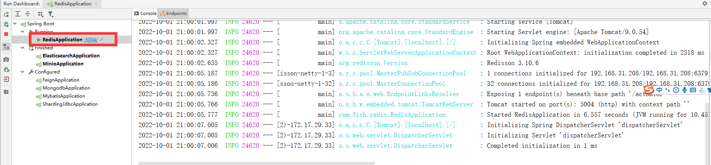
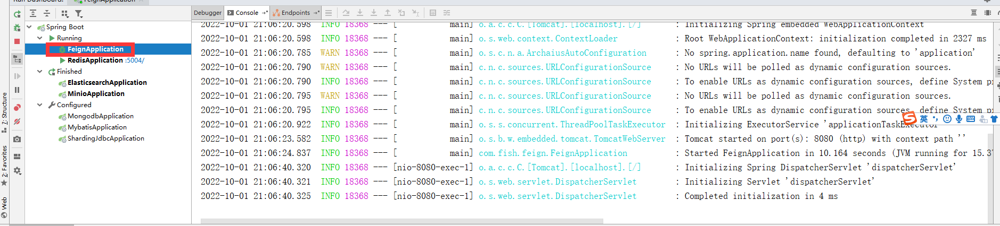
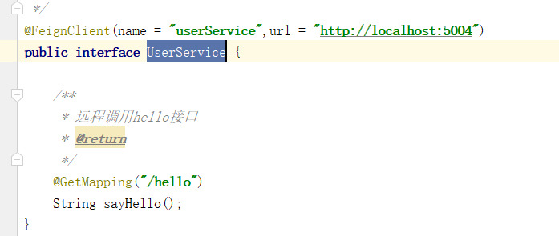

# 如何单独使用feign

## 1、启动其他服务，以redis项目示例



访问[localhost:5004/hello](http://localhost:5004/hello)


## 2、启动本服务



```java
UserService URL改成上面项目
```



访问[localhost:8080/hello](http://localhost:8080/hello)，调用成功！

