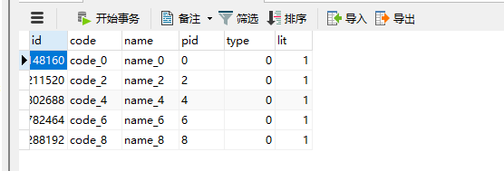

# springboot集成sharding-jdbc分库分表模式

## 1、分表模式

### 1.1修改application.yml，切换到fb模式

```yaml
spring:
  profiles:
    active: fb
```


### 1.2、创建test_order库

分别创建三张表`t_address`， `t_user0`，`t_user1`

```mysql
CREATE TABLE `t_address` (
  `id` bigint(20) NOT NULL AUTO_INCREMENT,
  `code` varchar(64) DEFAULT NULL COMMENT '编码',
  `name` varchar(64) DEFAULT NULL COMMENT '名称',
  `pid` varchar(64) NOT NULL DEFAULT '0' COMMENT '父id',
  `type` int(11) DEFAULT NULL COMMENT '1国家2省3市4县区',
  `lit` int(11) DEFAULT NULL,
  PRIMARY KEY (`id`)
) ENGINE=InnoDB AUTO_INCREMENT=21 DEFAULT CHARSET=utf8;

CREATE TABLE `t_user0` (
  `id` bigint(20) NOT NULL,
  `name` varchar(64) DEFAULT NULL COMMENT '名称',
  `city_id` int(12) DEFAULT NULL COMMENT '城市',
  `sex` tinyint(1) DEFAULT NULL COMMENT '性别',
  `phone` varchar(32) DEFAULT NULL COMMENT '电话',
  `email` varchar(32) DEFAULT NULL COMMENT '邮箱',
  `create_time` timestamp NOT NULL DEFAULT CURRENT_TIMESTAMP ON UPDATE CURRENT_TIMESTAMP COMMENT '创建时间',
  `password` varchar(32) DEFAULT NULL COMMENT '密码',
  PRIMARY KEY (`id`)
) ENGINE=InnoDB DEFAULT CHARSET=utf8;

CREATE TABLE `t_user1` (
  `id` bigint(20) NOT NULL,
  `name` varchar(64) DEFAULT NULL COMMENT '名称',
  `city_id` int(12) DEFAULT NULL COMMENT '城市',
  `sex` tinyint(1) DEFAULT NULL COMMENT '性别',
  `phone` varchar(32) DEFAULT NULL COMMENT '电话',
  `email` varchar(32) DEFAULT NULL COMMENT '邮箱',
  `create_time` timestamp NOT NULL DEFAULT CURRENT_TIMESTAMP ON UPDATE CURRENT_TIMESTAMP COMMENT '创建时间',
  `password` varchar(32) DEFAULT NULL COMMENT '密码',
  PRIMARY KEY (`id`)
) ENGINE=InnoDB DEFAULT CHARSET=utf8;
```

### 1.3、调用接口

调用[localhost:5002/address/save](http://localhost:5002/address/save)接口生成t_address表数据，数据如下图所示：


调用http://localhost:5002/address/get/21接口查询id=21的数据


调用[localhost:5002/user/save](http://localhost:5002/user/save)接口生成t_user0、t_user1表数据，t_user0和t_user1分别存储了5条数据


调用http://localhost:5002/user/get/{id}接口查询t_user0、t_user1表数据


## 2、分库分表模式

### 2.1修改application.yml，切换到fkfb模式

```yaml
spring:
  profiles:
    active: fkfb
```

### 2.2、创建order2库

分别创建三张表`t_address`， `t_user0`，`t_user1`

```mysql
CREATE TABLE `t_address` (
  `id` bigint(20) NOT NULL AUTO_INCREMENT,
  `code` varchar(64) DEFAULT NULL COMMENT '编码',
  `name` varchar(64) DEFAULT NULL COMMENT '名称',
  `pid` varchar(64) NOT NULL DEFAULT '0' COMMENT '父id',
  `type` int(11) DEFAULT NULL COMMENT '1国家2省3市4县区',
  `lit` int(11) DEFAULT NULL,
  PRIMARY KEY (`id`)
) ENGINE=InnoDB AUTO_INCREMENT=21 DEFAULT CHARSET=utf8;

CREATE TABLE `t_user0` (
  `id` bigint(20) NOT NULL,
  `name` varchar(64) DEFAULT NULL COMMENT '名称',
  `city_id` int(12) DEFAULT NULL COMMENT '城市',
  `sex` tinyint(1) DEFAULT NULL COMMENT '性别',
  `phone` varchar(32) DEFAULT NULL COMMENT '电话',
  `email` varchar(32) DEFAULT NULL COMMENT '邮箱',
  `create_time` timestamp NOT NULL DEFAULT CURRENT_TIMESTAMP ON UPDATE CURRENT_TIMESTAMP COMMENT '创建时间',
  `password` varchar(32) DEFAULT NULL COMMENT '密码',
  PRIMARY KEY (`id`)
) ENGINE=InnoDB DEFAULT CHARSET=utf8;

CREATE TABLE `t_user1` (
  `id` bigint(20) NOT NULL,
  `name` varchar(64) DEFAULT NULL COMMENT '名称',
  `city_id` int(12) DEFAULT NULL COMMENT '城市',
  `sex` tinyint(1) DEFAULT NULL COMMENT '性别',
  `phone` varchar(32) DEFAULT NULL COMMENT '电话',
  `email` varchar(32) DEFAULT NULL COMMENT '邮箱',
  `create_time` timestamp NOT NULL DEFAULT CURRENT_TIMESTAMP ON UPDATE CURRENT_TIMESTAMP COMMENT '创建时间',
  `password` varchar(32) DEFAULT NULL COMMENT '密码',
  PRIMARY KEY (`id`)
) ENGINE=InnoDB DEFAULT CHARSET=utf8;
```

ds0和ds1中分别连接test_order和order2库

```yaml
	 ds0:
        type: com.alibaba.druid.pool.DruidDataSource
        driver-class-name: com.mysql.jdbc.Driver
        url: jdbc:mysql://192.168.1.1:3305/test_order
        username: root
        password: password
      # 数据源ds1
      ds1:
        type: com.alibaba.druid.pool.DruidDataSource
        driver-class-name: com.mysql.jdbc.Driver
        url: jdbc:mysql://192.168.1.1:3305/order2
        username: root
        password: 111111
```

此时两个库中的表结构是一模一样的。


### 2.3、调用接口

调用[localhost:5003/address/save](http://localhost:5003/address/save)接口生成t_address表数据，此时两个库中分别生成数据如下图所示：




调用http://localhost:5003/address/get/783364903309148160 接口查询id=783364903309148160的数据，查询的是order2库t_address表


调用http://localhost:5003/address/get/783364904491941888 接口查询id=783364904491941888的数据，查询的是test_order库t_address表


调用[localhost:5003/user/save](http://localhost:5003/user/save)接口生成test_order库t_user0和order2库t_user1表数据，t_user0和t_user1分别存储了5条数据


调用http://localhost:5003/user/get/{id}接口查询t_user0、t_user1表数据


